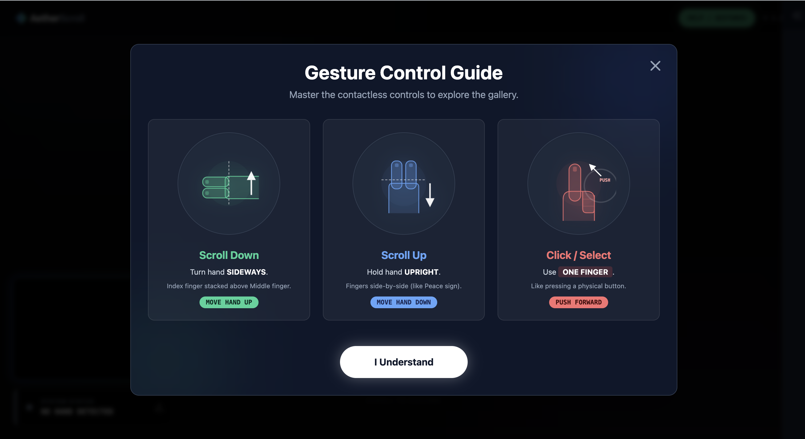

# GestureScroll AI

**[Live Demo](https://bjz05.github.io/Touch-Free-Mouse/)**

A contactless web interface powered by computer vision. Navigate content using specific hand gestures and receive real-time AI feedback on your technique.

## Features

*   **Touchless Navigation**: Scroll vertically and interact with content without physical contact.
*   **Orientation-Aware Scrolling**: Uses hand orientation (Vertical vs. Horizontal) to determine scroll direction.
*   **Air Click**: Detects depth (Z-axis) movement to simulate clicks via a "push" gesture.
*   **Privacy-First**: Video processing happens locally in the browser via MediaPipe.

## Usage Guide

| Action | Gesture | Movement |
| :--- | :--- | :--- |
| **Scroll Down** | **Sideways Hand** (Horizontal) | Move Hand **UP** |
| **Scroll Up** | **Upright Hand** (Vertical) | Move Hand **DOWN** |
| **Cursor** | **One Finger** (Index) | Move Freely |
| **Click** | **One Finger** (Index) | Quick **PUSH** Forward |

## Legal & Privacy

**License**
This project is licensed under the MIT License.

**Privacy Notice**
*   **Video Data**: All computer vision processing is performed locally on your device using MediaPipe. No video footage is ever sent to a server or stored.
*   **AI Data**: Only numerical coordinate data (X, Y points) is sent to the Google Gemini API when you request gesture analysis.
*   **Camera Permission**: This app requires camera access solely for real-time gesture detection.

**Disclaimer**
This software is provided "as is", without warranty of any kind, express or implied.
